
# Introduction to Software Systems S26 
## Assignment 2

The assignment is available [here](https://arihant25.github.io/iss-s26-a2/).

[This](https://hackmd.io/tNHsqwNhRoy12Oql-5cpwQ) is where you can ask questions about it, for which you will receive answers [here](https://hackmd.io/KiR2DviZT8OyzNutMPdK9w).

Good luck, have fun!

## Jayanth Raveendra – 2025101019

## D4 Feature Implementation

For D4, I chose to implement **A2 – Session-Persistent Reading Progress** from Group A and **B2 – Collapsible Timeline with Event Delegation** from Group B.

### A2 – Session-Persistent Reading Progress

I implemented session-persistent reading progress to improve user experience when reading content on the About page. The progress indicator allows users to see how far they have progressed through the content and maintains this progress during the session even if the page is refreshed or revisited. This helps users keep track of their reading position and makes the website feel more interactive and user-friendly. The user can reload their reading progress by clicking on a resume button which is part of a disappearing prompt that appears on the lower right corner of their window.

### B2 – Collapsible Timeline with Event Delegation

I implemented a collapsible timeline on the About page where each timeline milestone can be expanded or collapsed to show more information. Instead of adding separate event listeners to each timeline item, I used event delegation to handle all interactions efficiently through a parent element. This improves performance and keeps the JavaScript code cleaner and more scalable.

---

## Typography

My typographic pairing is **Playfair Display** and **Inter**.

**Justification:**
I wanted my headings to have a slightly formal and elegant appearance, while the body text should remain clean, readable, and neutral. Playfair Display gives the headings a formal and slightly academic look, while Inter is highly readable and modern, making it suitable for body text. This combination gives the website a clean but slightly formal appearance, which I feel reflects my personality and my approach to work and design.

---

## Animation in D3

For the hero entrance animations, I implemented them across all four pages so that users see elements in order of importance and visual hierarchy.

* **Home page:** The welcome heading appears first, followed by the description, the “View Projects” and "About Me" buttons, and finally the skills section. This guides the user’s attention in the correct visual order.
* **About page:** The personal statement appears first, followed by the timeline, directing attention to the most important content first.
* **Projects page:** I applied animations to the project cards using the Intersection Observer API. This effect is especially noticeable on mobile portrait mode, where cards are arranged in a column and animate individually as they enter the viewport. On desktop view, since all cards are visible at once, they animate simultaneously.
* **Contact page:** The contact links appear first, followed by a prompt and then the form, again maintaining visual hierarchy.

These animations help guide the user through the content, establish visual order, and give the website a more professional and polished feel. Using animations consistently across all four pages also maintains uniformity and smoothness in the user experience.

I implemented a micro-interaction on all the buttons in the website using a custom cubic-bezier easing curve. The animation accelerates quickly at the beginning and then decelerates toward the end, mimicking the feel of a mechanical button press. This subtle interaction makes the interface feel more responsive and provides a tactile, real-world feel to the digital interface.

A custom cubic-bezier easing curve is also applied to the timeline accordion on the About page. The timeline content expands quickly when opened, giving the interface a responsive feel, and collapses more slowly to create a smooth and natural closing motion. These easing adjustments reduce the perceived jerkiness of the max-height transition and improve the overall user experience.

## Website Report Screenshots

### W3 Validator

Home 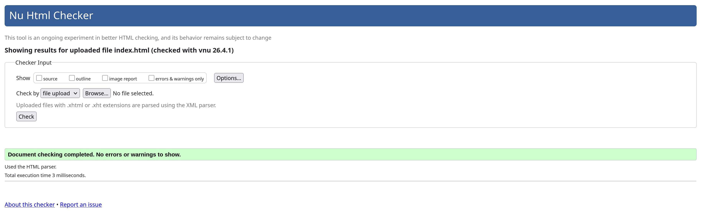

About 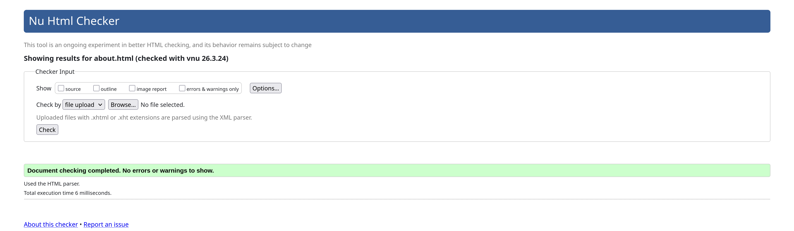

Projects 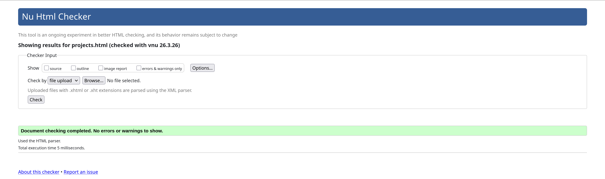

Contact 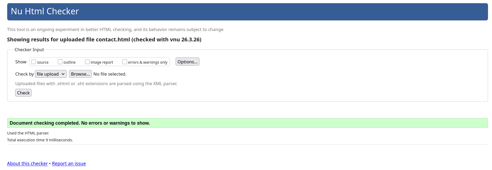

### Lighthouse

Home 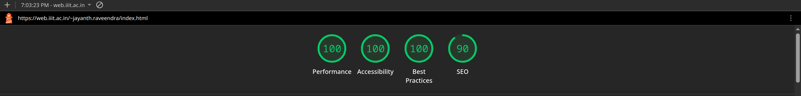

About 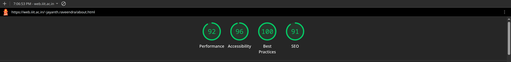

Projects 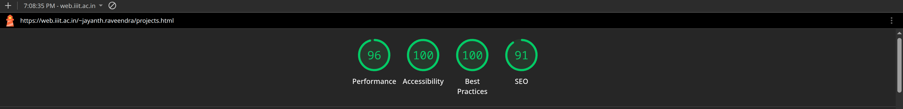

Contact 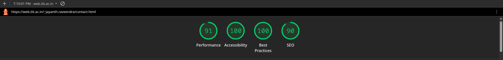

### WCAG AA - Light Theme

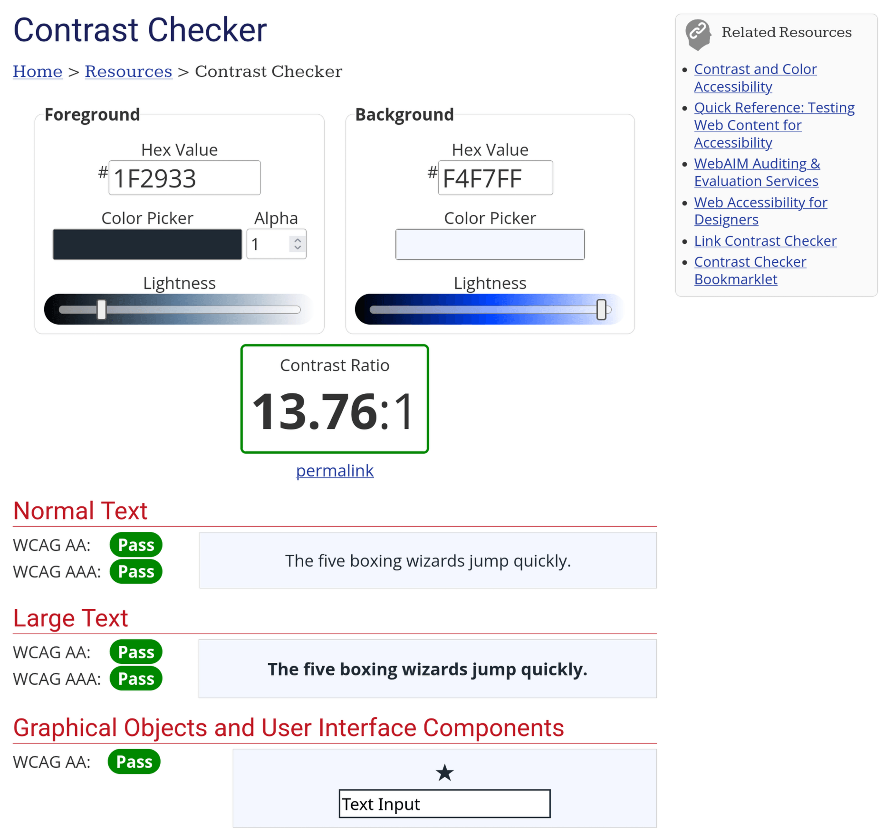

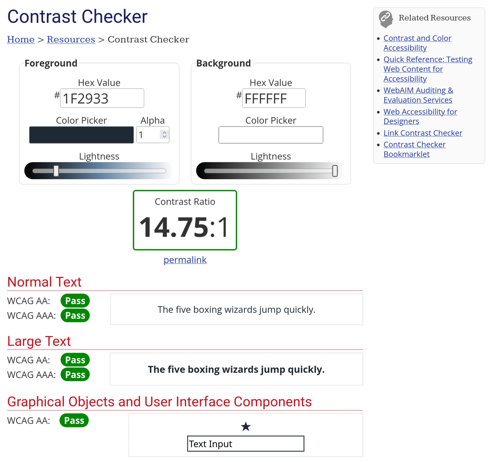

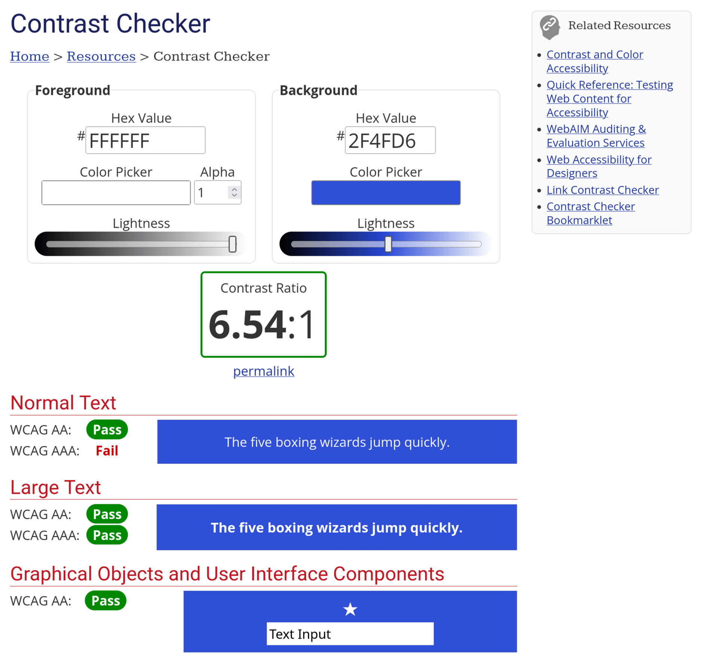

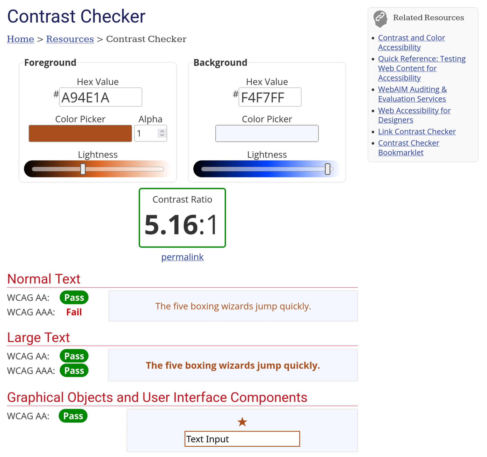

### WCAG AA - Dark Theme

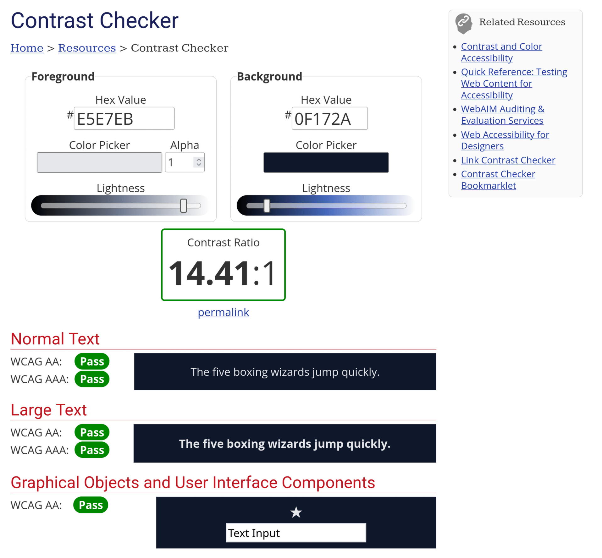

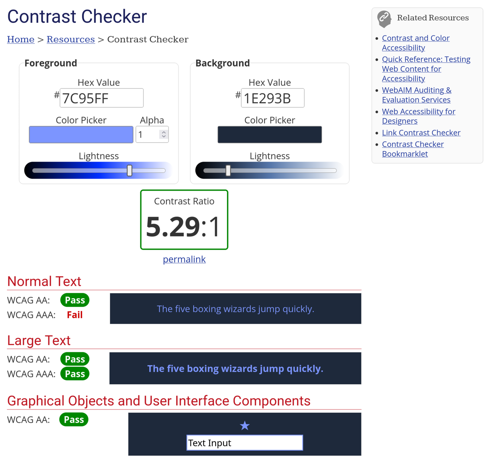

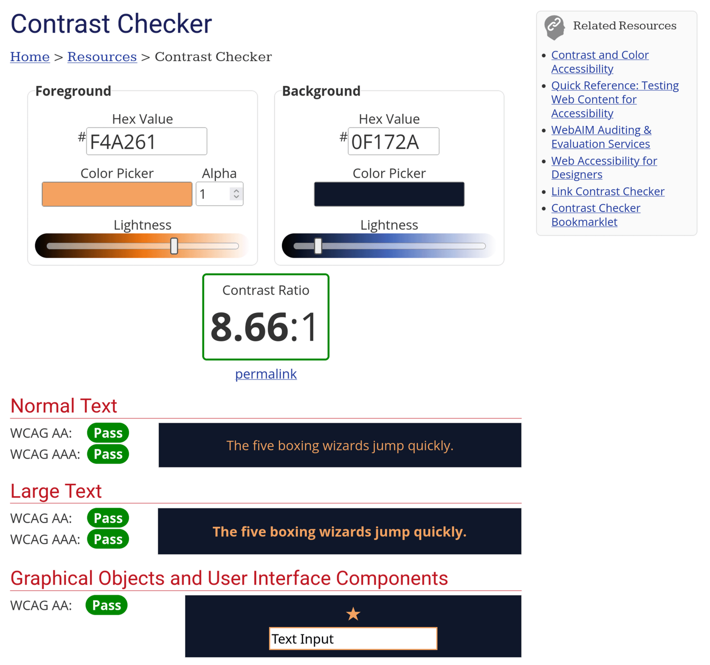

## Live URL of deployment on IIIT servers
https://web.iiit.ac.in/~jayanth.raveendra/index.html
### 
